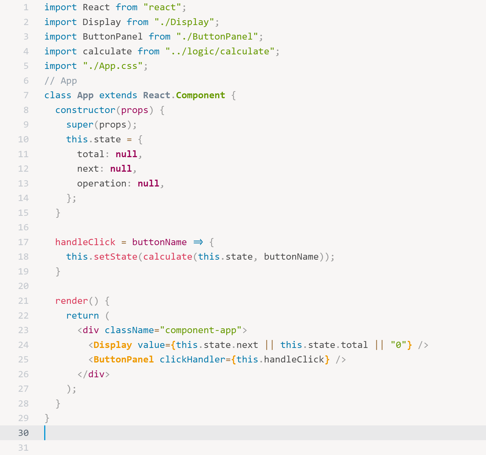

# Prism

[](https://marketplace.visualstudio.com/items?itemName=usernamehw.prism)
[](https://marketplace.visualstudio.com/items?itemName=usernamehw.prism)
[](https://marketplace.visualstudio.com/items?itemName=usernamehw.prism)
[](https://marketplace.visualstudio.com/items?itemName=usernamehw.prism)
[](http://opensource.org/licenses/MIT)


Light theme based on the [Prism.js](https://prismjs.com/) default light theme.



### Recommended settings

```js
"editor.scrollbar.verticalScrollbarSize": 18,
```